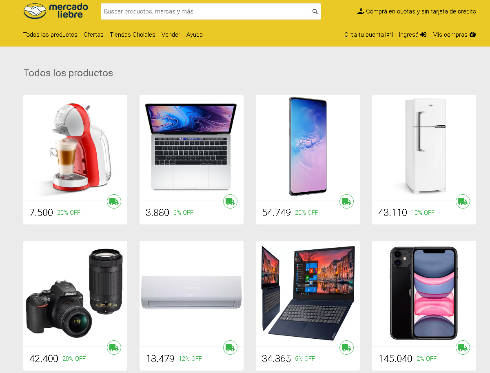
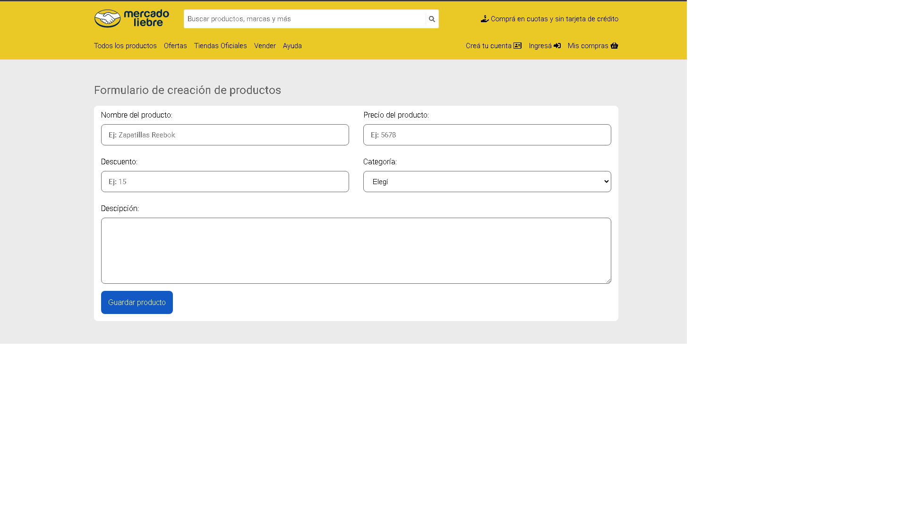
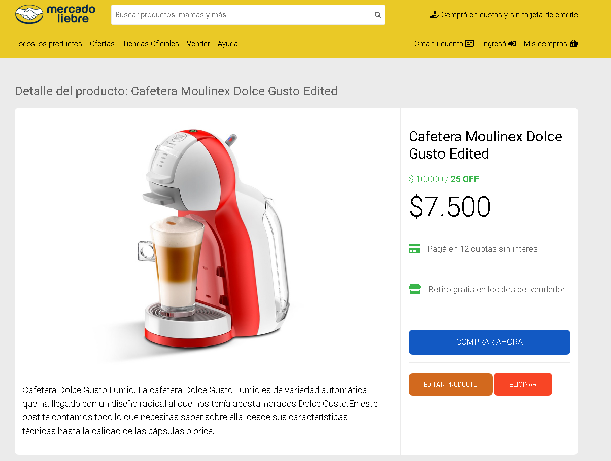
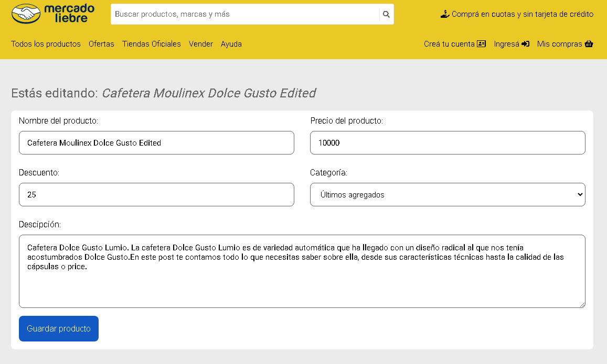

# Tp Mercado Liebre, Digital House C21 

### web render[https://mercadoliebre2-6nme.onrender.com/]

<figure></figure><figure><figure>   <figure></figure> <figure></figure> 


## Instrucciones

Para ejecutar el proyecto, sigue estos pasos:

1. Clona el repositorio en tu máquina local utilizando el siguiente comando:

```bash
git clone https://github.com/Aubar48/mercadoLiebre2
```

2. Navega hasta el directorio del proyecto:

```bash
cd mercadoLiebre2
```

3. Instala las dependencias del proyecto con el siguiente comando:

```bash
npm install
```

4. Inicia el servidor de desarrollo ejecutando el siguiente comando:

```bash
npm start || nodemon
```

### El servidor se levantará en el puerto 3000. Puedes acceder a la aplicación en tu navegador web utilizando la siguiente URL: [http://localhost:3000](http://localhost:3000)